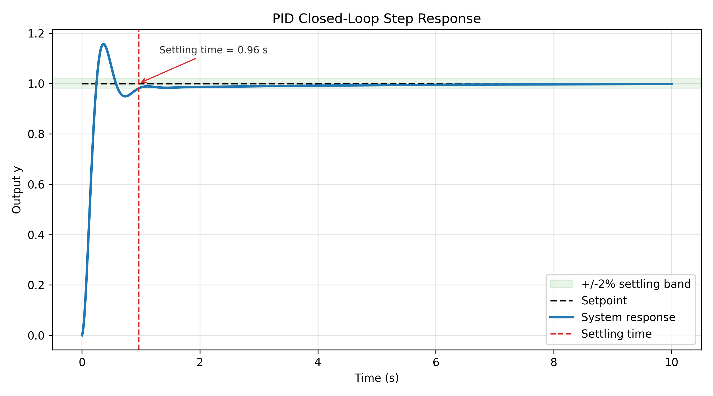
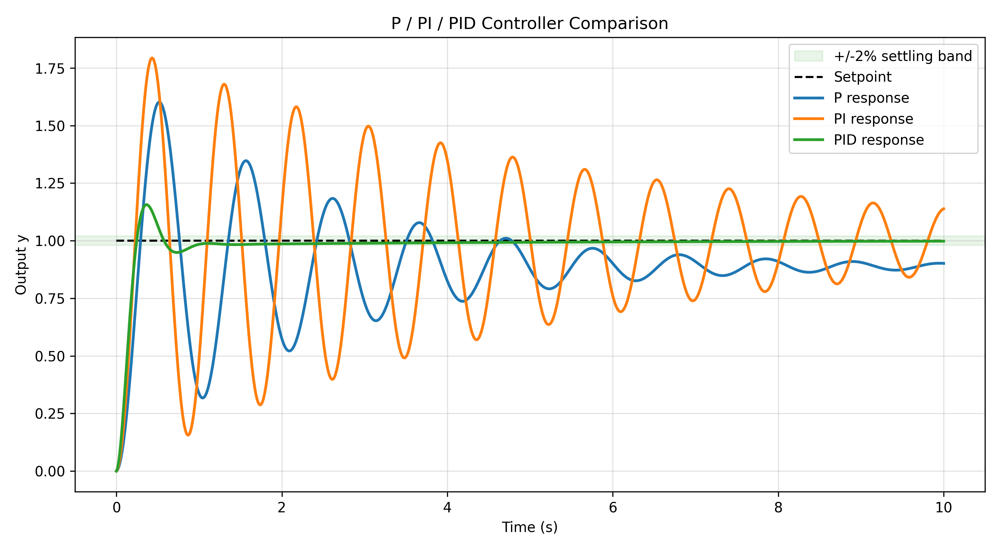

# pid-second-order-simulation

## Project Overview

This project simulates closed-loop control of a standard second-order dynamic system using hand-written Python code. It compares P, PI, and PID controllers on the same step input and automatically generates response plots plus key performance metrics.

The goal is not to hide the control logic behind advanced libraries. The plant update, PID calculation, simulation loop, and metric calculations are implemented directly with `numpy` and `matplotlib` only.

## Why This Project Matters

For automation and control engineering students, this project connects textbook control ideas with executable simulation code. It shows how controller gains affect transient response, finite-horizon tracking accuracy, and settling behavior in a way that is easy to inspect and modify.

## Control Objective

The closed-loop system tracks a unit step reference:

| Parameter | Value |
| --- | ---: |
| Setpoint | `1.0` |
| Simulation time | `10.0 s` |
| Time step | `0.01 s` |
| Natural frequency `wn` | `2.0 rad/s` |
| Damping ratio `zeta` | `0.3` |

## Mathematical Model

The plant is the standard second-order system:

```text
G(s) = wn^2 / (s^2 + 2*zeta*wn*s + wn^2)
```

For numerical simulation, it is written in state-space form:

```text
x1 = y
x2 = dy/dt

dx1/dt = x2
dx2/dt = wn^2*u - 2*zeta*wn*x2 - wn^2*x1
```

The code uses explicit Euler integration:

```text
next_state = current_state + derivative * dt
```

This is intentionally simple so that the simulation method remains readable for beginners.

## Controller Design

The controller uses the standard PID law:

```text
u = Kp*error + Ki*integral(error) + Kd*d(error)/dt
```

The same `PIDController` class is used for all three cases:

| Controller | Kp | Ki | Kd |
| --- | ---: | ---: | ---: |
| P | 8.0 | 0.0 | 0.0 |
| PI | 12.0 | 4.0 | 0.0 |
| PID | 20.0 | 5.0 | 2.0 |

These are the final parameters used in the project. The derivative term is set to zero on the first simulation step to avoid an artificial derivative kick caused only by missing previous-error history. The gains are intentionally chosen as an illustrative teaching set rather than a globally optimized tuning result.

### P

The P controller reacts to the current error. It is simple and fast, but because the plant has finite DC gain under proportional feedback, it usually leaves a nonzero final tracking error.

### PI

The PI controller adds accumulated error. This improves final tracking behavior, but the integral action can increase overshoot and oscillation if the gains are too aggressive.

### PID

The PID controller adds derivative action. In this simulation, derivative feedback improves damping and gives a faster, cleaner response than pure PI control.

## Performance Metrics

The project reports three teaching-oriented metrics:

| Metric | Definition used here |
| --- | --- |
| Overshoot | `(peak response - setpoint) / setpoint * 100%`, clipped to `0` if the response never exceeds the setpoint |
| Final-window tracking error | Absolute difference between the setpoint and the average of the final 100 response samples |
| Settling time | First time after which the response remains within a +/-2% band around the setpoint |

The final-window tracking error is this project's finite-horizon approximation of steady-state behavior. It is not a strict theoretical steady-state error as `t -> infinity`.

If the response does not remain within the +/-2% band before the simulation ends, settling time is reported as `Not settled`.

## Project Structure

```text
pid-second-order-simulation/
|
+-- main.py
+-- requirements.txt
+-- README.md
|
+-- src/
|   +-- __init__.py
|   +-- second_order_system.py
|   +-- pid_controller.py
|   +-- simulation.py
|   +-- metrics.py
|
+-- outputs/
    +-- pid_response.png
    +-- controller_comparison.png
    +-- performance_metrics.txt
```

## How to Run

Install dependencies:

```bash
pip install -r requirements.txt
```

Run the simulation:

```bash
python main.py
```

The script creates the `outputs/` folder automatically and writes all plots and metrics there. It also refreshes the generated results table in this README.

## Simulation Results

<!-- RESULTS_TABLE_START -->
| Controller | Overshoot | Final-window tracking error | Settling time |
| --- | ---: | ---: | ---: |
| P | 60.1908% | 0.1122 | Not settled |
| PI | 79.3172% | 0.0143 | Not settled |
| PID | 15.6392% | 0.0022 | 0.9600 |
<!-- RESULTS_TABLE_END -->

### PID Step Response



### Controller Comparison



## Key Observations

- P: fast initial response, visible final tracking error, and no settling within the 10 s simulation horizon.
- PI: much smaller final-window tracking error, but aggressive integral action causes the largest overshoot and persistent oscillation.
- PID: best balance in this example, with the smallest final-window tracking error and the only response that settles within the simulation horizon.

## Skills Demonstrated

- Implemented a second-order dynamic system from its differential equations.
- Built a reusable PID controller that can represent P, PI, and PID behavior.
- Wrote a clear simulation loop using explicit Euler integration.
- Computed control performance metrics without using `scipy.signal` or `python-control`.
- Generated clean plots and text output suitable for project documentation.

## Resume Bullet Points

- Developed a Python control-system simulation for a second-order plant using hand-written numerical integration and PID control logic.
- Compared P, PI, and PID controllers using overshoot, final-window tracking error, and settling-time metrics.
- Produced automated visualization and reporting outputs for a small, reproducible engineering project.

## Future Improvements

- Add optional actuator saturation and integral anti-windup to make the controller more realistic.
- Add command-line arguments for changing controller gains and plant parameters without editing source code.
- Compare Euler integration with a higher-accuracy method such as RK4 for numerical-method learning.
